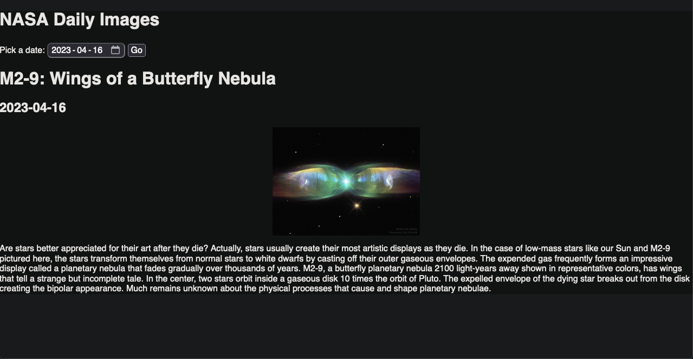

# My Awesome Project
A cool website to view daily nasa images. 

**Link to project:** https://dailynasaimages.netlify.app

## How It's Made:

**Tech used:** HTML, CSS, JavaScript, 

Used nasa api and built a website around it to be able to display the images, date the image what taken and a description about the image. 

## Optimizations

## Lessons Learned:

I learned a lot about how API's work as well as how to implement then in order to receive the data back to display in a browser. 

## Examples:
Take a look at these other projects I have in my own portfolio:

**Jack the Balloon Twister:** https://github.com/rs8799/jacktheballoontwister

**Elevation Bike Repair:** https://github.com/rs8799/elevation-bike-repair

**Portfolio:** https://github.com/rs8799/ray-sanford-portfolio

